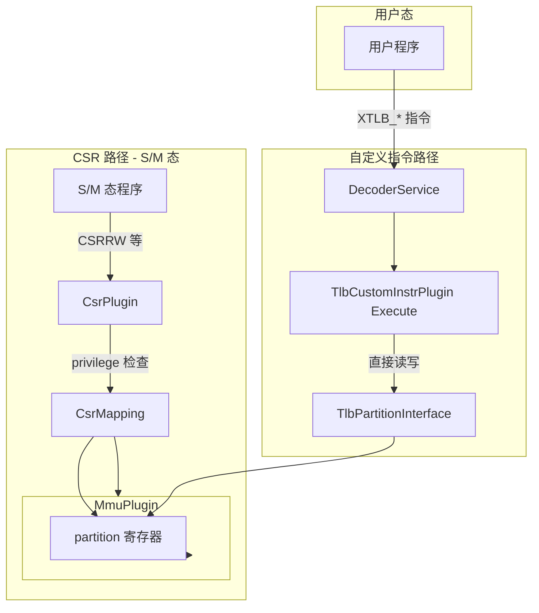
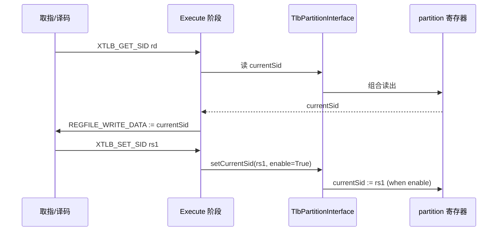

# 基于自定义指令实现 TLB 分区 CSR 功能

本文记录自定义指令实现：**将 TLB 分区相关 CSR 的可见功能通过自定义指令暴露给用户态使用**，以绕开 CSR 在用户态不可读/不可写的限制。

## 目标

- **用户态可用**：通过自定义指令在 U-mode 直接读写 TLB 分区控制寄存器与触发命令。
- **保持兼容**：原有 CSR 通路不删除。
- **同一底层状态**：CSR 与自定义指令驱动的是 **同一组** `MmuPlugin` 内部 `partition` 寄存器/触发器。

## 总体架构

- **新增一个服务接口** `TlbPartitionInterface`，作为跨插件访问 `MmuPlugin` 分区控制面的契约。
- `MmuPlugin` 实现 `TlbPartitionInterface`，并在原 CSR 写入的基础上增加一条“外部写入/触发”通路。
- 新增 `TlbCustomInstructionPlugin`：解码 `custom-0`（opcode=0x0B）指令，在 Execute 阶段直接调用 `TlbPartitionInterface` 完成读写/触发。
- 在 `VexRiscvSmpCluster.scala` 中，当 `withMmu && tlbPartitioning` 时才把 `TlbCustomInstructionPlugin` 加入插件列表，避免影响未启用分区的配置。

## 文件变更说明

### 1) 新增服务接口

- `src/main/scala/vexriscv/Services.scala`
  - 新增 `trait TlbPartitionInterface`
  - 暴露寄存器读口：`currentSid/allocSid/freeSid/flushSid/status`
  - 暴露写入口：`setCurrentSid/setAllocSid/setFreeSid/setFlushSid`
  - 暴露触发入口：`setTriggers(alloc, free, flushSid, flushAll)`

### 2) 修改 `MmuPlugin`：实现接口 + 外部通路

- `src/main/scala/vexriscv/plugin/MmuPlugin.scala`
  - `class MmuPlugin ... extends ... with TlbPartitionInterface`
  - 在 `val csr = pipeline plug new Area { ... }` 的 `partition` 内新增 `ext` Area：
    - `ext.set*Valid / ext.set*Value`：外部写寄存器
    - `ext.*Trigger`：外部命令触发
  - **触发合并**：
    - CSR 写 `TLB_CMD` 产生的触发脉冲，与 `partition.ext.*Trigger` 做 OR 合并，驱动原有逻辑。
  - **外部写入优先**：
    - `when(partition.ext.setXValid) { partition.x := partition.ext.setXValue }`
  - 最终将 `partition` 中寄存器句柄挂到 `TlbPartitionInterface` 的返回值上，供其他插件访问。

### 3) 新增自定义指令编码常量

- `src/main/scala/vexriscv/Riscv.scala`
  - 新增 7 条 `MaskedLiteral` 常量：`XTLB_*`
  - 编码约束：
    - opcode 固定为 **custom-0**（`0x0B`，二进制 `0001011`）
    - `funct3` 固定为 `000`
    - 用 `funct7` 区分不同操作（0x00 ~ 0x06）
    

### 4) 新增自定义指令插件

- `src/main/scala/vexriscv/plugin/TlbCustomInstructionPlugin.scala`
  - **setup**：向 `DecoderService` 注册 `XTLB_*` 指令的解码
  - **build**：在 Execute 阶段调用 `pipeline.service(classOf[TlbPartitionInterface])`
    - 读类指令将结果写到 `REGFILE_WRITE_DATA`
    - 写/触发类指令通过接口产生外部写入/触发信号（不经过 CSR privilege 检查）

### 5) 集群配置接入（条件启用）

- `src/main/scala/vexriscv/demo/smp/VexRiscvSmpCluster.scala`
  - 当 `withMmu && tlbPartitioning` 时：`config.plugins += new TlbCustomInstructionPlugin`

### 6) C/汇编侧 encoding.h 宏（测试使用）

- `src/test/cpp/regression/encoding.h`
- `src/test/cpp/raw/deleg/src/encoding.h`
  - 新增：
    - `MASK_XTLB  0xfe00707f`
    - `MATCH_XTLB_*` 若干（funct7<<25 | 0x0B）

## 自定义指令语义

指令名与语义如下（均为 Execute 阶段完成）：

- **XTLB_GET_SID**：`rd = currentSid`
- **XTLB_SET_SID**：`currentSid = rs1`
- **XTLB_GET_STATUS**：`rd = status`
- **XTLB_SET_ALLOC_SID**：`allocSid = rs1`
- **XTLB_SET_FREE_SID**：`freeSid = rs1`
- **XTLB_SET_FLUSH_SID**：`flushSid = rs1`
- **XTLB_CMD**：触发命令，取 `rs1[3:0]`：
  - bit0：alloc
  - bit1：free
  - bit2：flushSid
  - bit3：flushAll

## 兼容性与安全注意事项

- **兼容**：原 CSR 机制仍在（本实现是“额外通路”）；S/M 态仍可走 CSR。
- **安全**：用户态可直接切换 SID/触发 alloc/free/flush。若产品化需要限制，应在 SoC/OS 策略层面禁用该插件或添加额外仲裁/授权逻辑。

## Litex 生成命令（更新）

`VexRiscvLitexSmpClusterCmdGen` 已支持/默认包含 TLB 分区参数（见 `src/main/scala/vexriscv/demo/smp/VexRiscvSmpLitexCluster.scala`）。本次修改后，为了**显式启用** TLB 分区（从而自动加入 `TlbCustomInstructionPlugin`），建议在原命令基础上补充这些参数：

```bash
sbt "runMain vexriscv.demo.smp.VexRiscvLitexSmpClusterCmdGen --cpu-count=1 --reset-vector=0 --ibus-width=32 --dbus-width=32 --dcache-size=4096 --icache-size=4096 --dcache-ways=1 --icache-ways=1 --litedram-width=64 --aes-instruction=False --expose-time=False --out-of-order-decoder=True --privileged-debug=False --hardware-breakpoints=1 --wishbone-memory=False --fpu=False --cpu-per-fpu=4 --rvc=False --netlist-name=VexRiscvLitexSmpCluster_Cc1_Iw32Is4096Iy1_Dw32Ds4096Dy1_ITs4DTs4_Ldw64_Ood_Hb1 --netlist-directory=/home/cva6/output/ --dtlb-size=4 --itlb-size=4 --tlb-partitioning=True --tlb-secure-set-count=0 --tlb-sets-per-secure-domain=1 --tlb-max-secure-domains=0 --tlb-allow-ns-reuse=False --jtag-tap=False"
```

说明：

- `--tlb-partitioning=True`：开启分区逻辑（本仓库当前默认值也是 `true`，显式写出以避免后续默认值变化造成困扰）
- 其余 `--tlb-*` 参数这里给出的是**默认值**（与当前实现兼容），你可以按需求调整 secure set 数、每个域占用 set 数、最大域数等

---

## 设计方案（归档）

> 说明：以下内容作为设计阶段的记录归档；实现以本文前半部分“文件变更说明/自定义指令语义”为准。

# CSR 功能自定义指令设计方案

## 1. 背景与问题

### 1.1 当前限制

- **CSR 权限检查**：CsrPlugin 在 [CsrPlugin.scala:1861](src/main/scala/vexriscv/plugin/CsrPlugin.scala) 通过 `privilege < csrAddress(9 downto 8)` 判定非法访问
- **RISC-V CSR 编码**：csr[9:8] 表示最低特权级（00=U, 01=S, 11=M）
- **TLB 分区 CSR**：0x500-0x505 的 csr[9:8]=01，需 S-mode 及以上，**用户态无法访问**

### 1.2 目标

将 TLB 分区相关 CSR 的功能通过自定义指令实现，使**用户态**也能读写这些寄存器，用于安全域切换、alloc/free/flush 等操作。

---

## 2. 架构设计



**核心思路**：自定义指令不经过 CSR 通路，在 Execute 阶段直接访问 MmuPlugin 的 partition 寄存器，因此不受 privilege 限制。

---

## 3. 需要映射的 CSR 功能

| CSR                   | 功能                      | 读写  | 自定义指令                      |
| --------------------- | ----------------------- | --- | -------------------------- |
| TLB_SID (0x500)       | 当前安全域 ID                | R/W | XTLB_GET_SID, XTLB_SET_SID |
| TLB_CMD (0x501)       | 命令触发 (alloc/free/flush) | W   | XTLB_CMD                   |
| TLB_ALLOC_SID (0x502) | 分配目标 SID                | R/W | XTLB_SET_ALLOC_SID         |
| TLB_FREE_SID (0x503)  | 释放目标 SID                | R/W | XTLB_SET_FREE_SID          |
| TLB_FLUSH_SID (0x504) | 刷新目标 SID                | R/W | XTLB_SET_FLUSH_SID         |
| TLB_STATUS (0x505)    | 命令执行状态                  | R   | XTLB_GET_STATUS            |

---

## 4. 指令编码设计

使用 **RISC-V custom-0** 保留 opcode（0x0B），funct7 区分操作：

| 指令                 | 格式      | funct7 | funct3 | 操作                  |
| ------------------ | ------- | ------ | ------ | ------------------- |
| XTLB_GET_SID       | rd, x0  | 0x00   | 0      | rd = currentSid     |
| XTLB_SET_SID       | x0, rs1 | 0x01   | 0      | currentSid = rs1    |
| XTLB_GET_STATUS    | rd, x0  | 0x02   | 0      | rd = status         |
| XTLB_CMD           | x0, rs1 | 0x03   | 0      | triggers = rs1[3:0] |
| XTLB_SET_ALLOC_SID | x0, rs1 | 0x04   | 0      | allocSid = rs1      |
| XTLB_SET_FREE_SID  | x0, rs1 | 0x05   | 0      | freeSid = rs1       |
| XTLB_SET_FLUSH_SID | x0, rs1 | 0x06   | 0      | flushSid = rs1      |

编码模式（opcode=0x0B）：

- `M"0000000----------000-----0001011"` (GET_SID)
- `M"0000001----------000-----0001011"` (SET_SID)
- ... 等

---

## 5. 实现方案

### 5.1 新增 TlbPartitionInterface 服务

在 [Services.scala](src/main/scala/vexriscv/Services.scala) 或新建文件中定义：

```scala
trait TlbPartitionInterface {
  def currentSid: UInt
  def allocSid: UInt
  def freeSid: UInt
  def flushSid: UInt
  def status: Bits
  def setCurrentSid(value: UInt, enable: Bool): Unit
  def setAllocSid(value: UInt, enable: Bool): Unit
  def setFreeSid(value: UInt, enable: Bool): Unit
  def setFlushSid(value: UInt, enable: Bool): Unit
  def setTriggers(alloc: Bool, free: Bool, flushSid: Bool, flushAll: Bool): Unit
}
```

### 5.2 修改 MmuPlugin

在 [MmuPlugin.scala](src/main/scala/vexriscv/plugin/MmuPlugin.scala) 中：

1. 当 `enablePartitioning` 时，实现并注册 `TlbPartitionInterface`
2. 将 partition 寄存器的写入口扩展为：CSR 写 **或** 自定义指令写（通过 mux 选择）
3. 对 TLB_CMD 的 trigger 信号，增加来自自定义指令的触发路径

### 5.3 新建 TlbCustomInstructionPlugin

新建 `src/main/scala/vexriscv/plugin/TlbCustomInstructionPlugin.scala`：

1. **setup**：向 DecoderService 注册 7 条自定义指令
2. **build**：在 Execute 阶段，根据指令类型调用 `TlbPartitionInterface` 进行读写
3. 读操作：将接口值写入 `REGFILE_WRITE_DATA`
4. 写操作：调用 `setCurrentSid` 等，并设置对应 enable

**依赖**：仅在存在 `TlbPartitionInterface` 且 TLB 分区启用时生效；若 MmuPlugin 未启用分区，该插件可配置为 no-op 或报错。

### 5.4 配置集成

在 [VexRiscvSmpCluster.scala](src/main/scala/vexriscv/demo/smp/VexRiscvSmpCluster.scala) 或 LiteX 生成配置中，当启用 `--tlb-partitioning` 时，将 `TlbCustomInstructionPlugin` 加入插件列表。

---

## 6. 数据流与时序



---

## 7. 可选扩展：其他用户态 CSR

若需将更多 CSR 暴露给用户态，可沿用同一模式：

- **cycle / instret**：若 `mcounteren` 限制用户读，可增加 `XCYCLE`、`XINSTRET` 等自定义读指令
- **扩展接口**：可定义 `UserCsrInterface`，由 CsrPlugin 或 CounterPlugin 实现，供自定义指令插件使用

当前方案先聚焦 TLB 分区 CSR。

---

## 8. 文件变更清单

| 文件                                                                                              | 操作                                        |
| ----------------------------------------------------------------------------------------------- | ----------------------------------------- |
| [Riscv.scala](src/main/scala/vexriscv/Riscv.scala)                                              | 新增 XTLB_* 指令的 MaskedLiteral 常量            |
| [Services.scala](src/main/scala/vexriscv/Services.scala)                                        | 新增 TlbPartitionInterface trait            |
| [MmuPlugin.scala](src/main/scala/vexriscv/plugin/MmuPlugin.scala)                               | 实现 TlbPartitionInterface，扩展 partition 写入口 |
| 新建 TlbCustomInstructionPlugin.scala                                                             | 实现 7 条自定义指令的解码与执行                         |
| [VexRiscvSmpCluster.scala](src/main/scala/vexriscv/demo/smp/VexRiscvSmpCluster.scala)           | 条件添加 TlbCustomInstructionPlugin           |
| [VexRiscvSmpLitexCluster.scala](src/main/scala/vexriscv/demo/smp/VexRiscvSmpLitexCluster.scala) | 同上                                        |
| 测试/encoding.h                                                                                   | 新增 XTLB_* 宏定义，供 C/汇编使用                    |

---

## 9. 安全与兼容性

- **安全**：用户态可直接切换 SID、触发 alloc/free/flush。若需限制，应由 OS 在 S-mode 通过 `sstatus.spp`、页表等做策略控制，或选择不启用该插件
- **兼容**：原有 CSR 路径保留，S/M 态仍可用 CSR 访问；自定义指令为额外通路
- **可选**：通过配置开关控制是否启用 `TlbCustomInstructionPlugin`，便于在不需用户态 TLB 控制的场景下关闭

