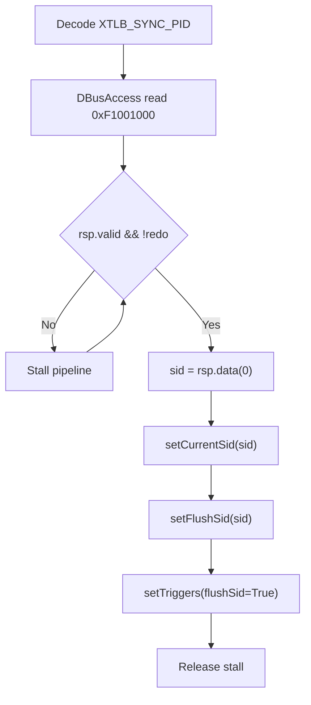

# TLB PID Sync 空指令方案设计

## 1. 目标

在当前 `TLB 分区 + 自定义指令` 实现基础上，新增一条由 OS 发起的“空指令”：

- 指令本身不带 SID 参数
- 硬件收到指令后自动从固定地址 `0xF1001000` 读取 PID（物理 MMIO，不走 MMU）
- 计算 `SID = PID % 2`（即取 `pid[0]`）
- 自动执行防护动作：
  1. 更新 `currentSid`
  2. 对新 SID 执行 `flushSid`

这样 OS 不需要直接拼接多条 `SET_SID/SET_FLUSH_SID/CMD` 指令，只要发一条同步指令即可。

---

## 2. 约束与前提

- PID 读取地址固定：`0xF1001000`
- 地址类型：**物理 MMIO**（不走 `SATP/MMU` 翻译）
- SID 规则：`SID = PID % 2`
- 防护动作：更新 SID 后执行 `flushSid(newSid)`（不是 `flushAll`）

---

## 3. 架构复用点

当前工程已有能力可直接复用：

1. `TlbPartitionInterface`  
   - 已提供 `setCurrentSid/setFlushSid/setTriggers` 接口
2. `MmuPlugin.partition.ext` 外部通路  
   - 已支持非 CSR 通路写寄存器和触发命令（与 CSR 触发 OR 合并）
3. `DBusAccessService`  
   - 可用于发起一次 32-bit 读请求（MMIO 读取 PID）

因此无需重做分区逻辑，只需增加“新指令 + 小状态机”。

---

## 4. 指令定义

沿用 custom-0：

- `opcode = 0x0B`
- `funct3 = 000`
- 新增 `funct7 = 0x07` 作为 `XTLB_SYNC_PID`

在 `Riscv.scala` 中新增：

- `XTLB_SYNC_PID = M"0000111----------000-----0001011"`

---

## 5. 硬件行为流程

## 5.1 流程图

## 5.2 时序语义

执行 `XTLB_SYNC_PID` 时：

1. 指令进入执行阶段，启动一次 DBus 只读请求到 `0xF1001000`
2. 在响应返回前，流水线保持停顿（确保“指令语义完成”）
3. 响应返回后：
   - `pid := rsp.data`
   - `sid := pid(0)`
   - `currentSid := sid`
   - `flushSid := sid`
   - 触发 `flushSidTrigger`（一拍）
4. 指令完成，流水继续

---

## 6. 实现方案

本仓库当前实现并未新增独立插件，而是把该能力**集成进现有架构**，以尽量复用已存在的总线访问与分区控制通路：

### 6.1 指令解码与流水停顿：集成在 `TlbCustomInstructionPlugin`

文件：`src/main/scala/vexriscv/plugin/TlbCustomInstructionPlugin.scala`

- 新增一个操作枚举：`XTLB_OP.SYNC_PID`
- `setup()` 中新增解码：
  - `decoder.add(XTLB_SYNC_PID, ..., XTLB_CTRL -> SYNC_PID, HAS_SIDE_EFFECT -> True)`
- `build()` 的 Execute 阶段行为：
  1. 调用 `tlb.requestPidSync(True)` 发起一次 PID 同步请求
  2. 用 `execute.arbitration.haltItself := tlb.pidSyncBusy` 停住该指令，直到硬件完成读 PID + 更新 SID + flushSid

这样 OS 侧只发一条 `XTLB_SYNC_PID`，硬件保证“指令退休前语义完成”。

### 6.2 PID 读取 + SID/flushSid 更新：集成在 `MmuPlugin`（复用同一个 `dBusAccess`）

文件：`src/main/scala/vexriscv/plugin/MmuPlugin.scala`

实现复用点：

- `MmuPlugin` 本来就通过 `DBusAccessService.newDBusAccess()` 获得 `dBusAccess`，用于页表 walk / refill
- 现在新增 PID 同步功能时，**不再新增第二条总线访问口**，而是：
  - 在 `shared` 状态机中新增 `PID_CMD / PID_RSP`
  - 与原有 `L1_CMD/L1_RSP/L0_CMD/L0_RSP` 共用同一条 `dBusAccess.cmd` 发起读请求

状态机要点：

- `pidSyncPending`：外部请求锁存（来自 `TlbPartitionInterface.requestPidSync`）
- `State.PID_CMD`：发起 `dBusAccess.cmd` 到固定地址 `0xF1001000`
- `State.PID_RSP`：等待 `dBusAccess.rsp` 返回
  - `sid := rsp.data(0)`（即 `PID % 2`）
  - `csr.partition.currentSid := sid`
  - `csr.partition.flushSid := sid`
  - `csr.partition.flushSidTrigger := True`（一拍触发）
  - `pidSyncPending := False`，回到 `IDLE`

忙信号：

- `pidSyncBusy := pidSyncPending || state =/= IDLE || extPidSyncReq`
  - 该 busy 通过 `TlbPartitionInterface.pidSyncBusy` 暴露给 `TlbCustomInstructionPlugin` 用于停顿指令

### 6.3 接口层：在 `TlbPartitionInterface` 增加 PID Sync 控制面

文件：`src/main/scala/vexriscv/Services.scala`

新增：

- `requestPidSync(enable: Bool)`
- `pidSyncBusy: Bool`

并由 `MmuPlugin` 实现：`requestPidSync` 通过 ext 通路将请求注入到 `MmuPlugin.shared` 状态机。

---

## 7. OS 使用方式

OS 在切换到新任务并更新 PID MMIO 后，只发一条：

- `XTLB_SYNC_PID`

硬件自动完成 SID 同步和 flushSid 防护动作。

---

## 8. 需修改的文件清单

1. `src/main/scala/vexriscv/Riscv.scala`  
   - 新增 `XTLB_SYNC_PID` 编码常量

2. `src/main/scala/vexriscv/Services.scala`  
   - 在 `TlbPartitionInterface` 中新增 `requestPidSync/pidSyncBusy`

3. `src/main/scala/vexriscv/plugin/MmuPlugin.scala`  
   - 在 `shared` 状态机中新增 `PID_CMD/PID_RSP`，复用 `dBusAccess` 读取 `0xF1001000` 并执行 `SID=PID%2 + flushSid`

4. `src/main/scala/vexriscv/plugin/TlbCustomInstructionPlugin.scala`  
   - 新增 `XTLB_SYNC_PID` 解码与执行期 `haltItself` 停顿逻辑

5. `src/test/cpp/regression/encoding.h` 与 `src/test/cpp/raw/deleg/src/encoding.h`  
   - 新增 `MATCH_XTLB_SYNC_PID` 宏，方便 OS侧调用

---

## 9. 注意事项

1. `0xF1001000` 可达性  
   - 必须保证该 MMIO 地址在当前总线拓扑下可读且及时响应

2. 指令阻塞影响  
   - 该指令会等待 MMIO 返回，频繁调用会增加调度开销

3. SID 位宽一致性  
   - 目前策略固定 `PID%2`，即只使用 1 bit SID；若将来扩展多域，需要同步升级映射策略

