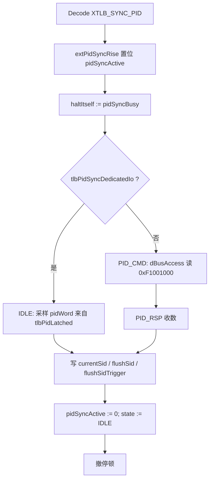

# TLB PID Sync 空指令 — 设计与当前实现

本文档描述 **`XTLB_SYNC_PID`** 的目标、双路径 PID 来源，以及与仓库中 **当前真实 RTL 实现** 一致的接线方式（含 Spinal 层次约束下的端口设计）。

---

## 1. 目标

在 **TLB 分区 + 自定义指令** 基础上，提供一条由 OS 发起的“空指令”：

- 指令**不显式带 SID**
- 硬件根据当前 **PID 字（32 bit）** 计算 **`SID = PID % 2`**（实现为 **`pid[0]`**）
- 自动完成：
  1. 更新 **`currentSid`**
  2. 对**新 SID** 执行 **`flushSid`**（非 `flushAll`）

OS 无需再拼 **`SET_SID` / `SET_FLUSH_SID` / `TLB_CMD`** 等多条指令即可完成一次上下文相关的 TLB 分区同步。

**PID 字来源（二选一，由 `MmuPlugin.tlbPidSyncDedicatedIo` 决定）：**

| 模式 | PID 来源 | 说明 |
|------|-----------|------|
| **专用 IO** | SoC 经 **`VexRiscv` 的输入端口 `tlb_pid_latched[31:0]`** 提供 | 不占用 MMU 的 **`DBusAccess`**，避免与页表 refill **互等/死锁**；LiteX CmdGen 在包装顶层用 **`pid_latched`** 驱动各核的 **`vex.tlbPidLatched`** |
| **DBus MMIO** | **`dBusAccess` 只读物理地址 `0xF1001000`** | 与 **`L1_CMD/L1_RSP/L0_CMD/L0_RSP`** 共用同一 **`shared` 状态机** 与 **`dBusAccess`** |

---

## 2. 约束与前提

- **`SID = PID % 2`** → 硬件使用 **`pidWord(0)`**，再 **`resize` 到 `partitionSidWidth`**
- 防护语义：**更新 SID + `flushSidTrigger` 一拍**（与既有分区 flush 逻辑一致）
- **MMIO 模式**：`0xF1001000` 为 **物理 MMIO**，不经 MMU 翻译
- **专用 IO 模式**：在 **`state == IDLE`** 且 **`pidSyncActive`** 时 **组合采样** `pidWord`（与 `tlbPidLatched` 为同一数据路径），**不进入 `PID_CMD/PID_RSP`**

---

## 3. 架构复用

- **`TlbPartitionInterface`**：`requestPidSync`、`pidSyncBusy`，及既有 SID/触发合并逻辑
- **`MmuPlugin.csr.partition`**：`currentSid`、`flushSid`、`flushSidTrigger` 与 TLB 分区表行为不变
- **`DBusAccessService`**：仅在 **MMIO 模式**下用于读 PID；**LiteX + 分区** 推荐专用 IO

---

## 4. 指令编码

- **`opcode = 0x0B`**（custom-0），**`funct3 = 000`**，**`funct7 = 0x07`**
- **`Riscv.scala`**：`XTLB_SYNC_PID = M"0000111----------000-----0001011"`
- C 侧测试头：**`MATCH_XTLB_SYNC_PID`** 等（`encoding.h`）

---

## 5. 硬件行为（状态机与停顿）

### 5.1 流程图

### 5.2 忙信号与上升沿（避免执行级“常拉高请求”卡死）

- 执行级会反复 **`requestPidSync(True)`**，故 **`extPidSyncReq` 可能多周期为真**。
- **`extPidSyncRise = extPidSyncReq && !RegNext(extPidSyncReq)`**，仅在上升沿 **`pidSyncActive := True`**。
- **`pidSyncBusy := pidSyncActive || (state =/= IDLE)`**，**不把 `extPidSyncReq` 直接 OR 进 busy**，否则指令无法退休。

### 5.3 `IDLE` 分支（与代码一致）

- **`when(pidSyncActive)`** 内用 **Scala 层 `if (tlbPidSyncDedicatedIo)`** 分支（避免 **Scala `Boolean` 与 Spinal `Bool` 混在 `when` 里**）：
  - **专用 IO**：本周期完成 SID 更新与 **`flushSidTrigger`**，**`pidSyncActive := False`**
  - **MMIO**：**`state := PID_CMD`**

---

## 6. 当前真实实现（按文件）

### 6.1 `VexRiscv` 端口（层次合法的数据入口）

**文件：** `src/main/scala/vexriscv/VexRiscv.scala`

- **`VexRiscvConfig`**：
  - **`var withTlbPidLatchedPort = false`**：由 **`vexRiscvConfig`** 在 **`withMmu && tlbPidSyncDedicatedIo`** 时置 **`true`**
  - 另：**`tlbPidLatched` 是否引出** 还兼容 **`plugins` 里存在 `MmuPlugin(tlbPidSyncDedicatedIo=true)`** 的推断（**`withTlbPidLatchedPort || exists(...)`**）
- **`VexRiscv.tlbPidLatched`**：
  - 若需要端口：**`in(Bits(32 bits)).setName("tlb_pid_latched")`**
  - 否则：内部 **`Bits` 恒 0**（未使用专用路径时）

综合网表中可搜 **`tlb_pid_latched`** 或等价命名。

### 6.2 `MmuPlugin`：别名到 CPU 端口 + `shared` 状态机

**文件：** `src/main/scala/vexriscv/plugin/MmuPlugin.scala`

- **构造参数 **`tlbPidSyncDedicatedIo: Boolean = false`****
- **`build()` 开头**（在 **`shared` Area 之前**）：
  - 若 **`tlbPidSyncDedicatedIo`**：**`pidSyncDedicatedBits = pipeline.tlbPidLatched`**  
    → 与 **`VexRiscv`** 的 **`in` 端口为同一信号**，**不在 MMU 内部再 `new Bits` 做跨层次驱动**
- **`shared`**：
  - **`pidWord`**：专用 IO 时为 **`pidSyncDedicatedBits`**，否则 **`B(0)`**
  - **`pidSyncActive` / `extPidSyncRise` / `pidSyncBusyWire`**：见 §5
  - **MMIO**：**`PID_CMD` / `PID_RSP`** 读 **`0xF1001000`**，写 SID 与 flush

### 6.3 `TlbCustomInstructionPlugin`

**文件：** `src/main/scala/vexriscv/plugin/TlbCustomInstructionPlugin.scala`

- **`XTLB_OP.SYNC_PID`**：**`requestPidSync(True)`** + **`haltItself := pidSyncBusy`**

### 6.4 `vexRiscvConfig` 与 LiteX CmdGen

**文件：** `src/main/scala/vexriscv/demo/smp/VexRiscvSmpCluster.scala`

- 参数 **`tlbPidSyncDedicatedIo: Boolean = false`** 传入 **`MmuPlugin`**
- 返回 **`config` 前**：**`if (withMmu && tlbPidSyncDedicatedIo) config.withTlbPidLatchedPort = true`**
- **`withMmu && tlbPartitioning`** 时追加 **`TlbCustomInstructionPlugin`**

**文件：** `src/main/scala/vexriscv/demo/smp/VexRiscvSmpLitexCluster.scala`

- **`VexRiscvLitexSmpClusterCmdGen`** 中 **`tlbPidSyncDedicatedIo = tlbPartitioning`**（与自定义指令启用条件对齐）
- **`dutGen`**：
  - 包装 **`Component`**：**`val pid_latched = in Bits(32 bits)`**
  - 对每个 core：**`core.cpu.logic.produce { ... }`** 内  
    **`vex.tlbPidLatched := pid_latched`**（仅当该核 **`cpuConfigs(i)`** 中 **`MmuPlugin.tlbPidSyncDedicatedIo`** 为真）

**层次说明（实现原因）：** Spinal **`PhaseCheckHierarchy`** 不允许用顶层 **`in`** 直接驱动 CPU 深层的 **`MmuPlugin_shared_*` 内部网**。当前做法是让 **PID 经 `VexRiscv` 的 `in` 端口**进入，再由父模块 **`:=`** 连接 **`pid_latched`**，从而通过检查。

### 6.5 `TlbPartitionInterface`

**文件：** `src/main/scala/vexriscv/Services.scala`

- **`requestPidSync` / `pidSyncBusy`**，由 **`MmuPlugin`** 实现。

---

## 7. OS / SoC 使用要点

- **LiteX + `--tlb-partitioning=True`**：启用专用 IO 时，SoC 需驱动 **包装顶层的 `pid_latched`**（或综合后与 **`tlb_pid_latched`** 相连的 net），再让 OS 在合适时机执行 **`XTLB_SYNC_PID`**。
- **仅用 MMIO 路径**：配置 **`tlbPidSyncDedicatedIo = false`**，保证 **`0xF1001000`** 可读，再发 **`XTLB_SYNC_PID`**。

---

## 8. 涉及文件清单

| 文件 | 作用 |
|------|------|
| `Riscv.scala` | `XTLB_SYNC_PID` 掩码 |
| `Services.scala` | `TlbPartitionInterface` |
| `VexRiscv.scala` | `withTlbPidLatchedPort`、`tlbPidLatched` 端口/ tie-off |
| `plugin/MmuPlugin.scala` | 双路径、`pidSyncDedicatedBits` 别名、`pidSyncActive`、MMIO FSM |
| `plugin/TlbCustomInstructionPlugin.scala` | 解码与停顿 |
| `demo/smp/VexRiscvSmpCluster.scala` | `tlbPidSyncDedicatedIo`、`withTlbPidLatchedPort`、`MmuPlugin`、`TlbCustomInstructionPlugin` |
| `demo/smp/VexRiscvSmpLitexCluster.scala` | `dutGen`：`pid_latched` → `vex.tlbPidLatched` |
| `src/test/cpp/.../encoding.h` 等 | `MATCH_XTLB_SYNC_PID` |

---

## 9. 注意事项

1. **DBus 与专用 IO**：高负载下 MMIO 路径可能与 refill 争用 **`dBusAccess`**；生产环境 **LiteX 分区配置** 建议走 **`tlb_pid_latched`**。
2. **时序**：执行 **`XTLB_SYNC_PID`** 时 **`tlb_pid_latched` / `pid_latched` 应稳定** 为当前任务 PID 字。
3. **多核**：当前 CmdGen 将 **同一 `pid_latched`** 接到 **各核 `tlbPidLatched`**；若需 per-hart PID，应在 SoC 侧 mux 或扩展生成器。
4. **SID 策略**：当前固定 **1 bit**；扩展多域需同时改硬件映射与软件约定。
